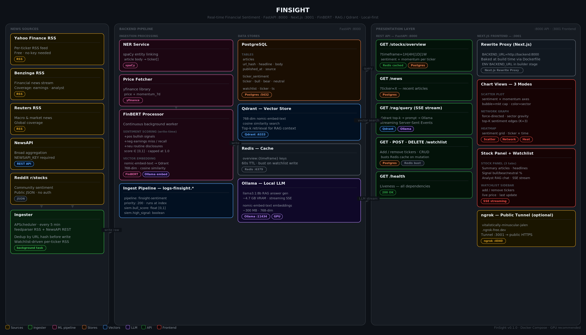

# FinSight

Real-time financial sentiment dashboard. Ingests news from multiple sources, runs FinBERT sentiment analysis, stores vectors in Qdrant for RAG, and serves an interactive Next.js frontend — all running locally with your GPU.



---

## What it does

FinSight pulls financial news every 5 minutes, scores each article with FinBERT (bull/bear/neutral), and lets you explore sentiment across your watchlist through three chart views:

- **Scatter Plot** — sentiment vs. momentum, bubble size = market cap
- **Network Graph** — force-directed clusters by sector, edges = co-sentiment similarity
- **Heatmap** — sentiment intensity by ticker × time

Each stock also has a panel with a **Summary** tab (recent articles), a **Signal** tab (bull/bear breakdown + price), and an **Analyst** tab — a RAG chatbot powered by llama3.1:8b that answers questions grounded in retrieved news.

---

## Stack

| Layer | Technology |
|---|---|
| **Frontend** | Next.js 14 (App Router), TypeScript, Canvas API |
| **Backend** | FastAPI, APScheduler, asyncpg |
| **Sentiment** | FinBERT (via Ollama) |
| **Embeddings** | nomic-embed-text (via Ollama) |
| **LLM / RAG** | llama3.1:8b (via Ollama), Qdrant |
| **Stores** | PostgreSQL, Qdrant, Redis |
| **Ingestion** | feedparser RSS, NewsAPI, Reddit public JSON |
| **Infra** | Docker Compose, ngrok (optional public URL) |

---

## Quick Start

### 1. Clone and configure

```bash
git clone https://github.com/derrickpehjh/finsight.git
cd finsight
cp .env.example .env
```

### 2. Fill in `.env`

```env
NEWSAPI_KEY=your_key_here        # free at newsapi.org — optional
NGROK_AUTHTOKEN=your_token       # optional — for public URL
NGROK_DOMAIN=your-domain.ngrok-free.dev
```

### 3. Start

```bash
docker compose up --build
```

Open **http://localhost:3001**

> **First run:** Ollama pulls `nomic-embed-text` (~300 MB) and `llama3.1:8b` (~4.7 GB) on startup. Allow 5–10 min. Subsequent starts are instant.

---

## Services & Ports

| Service | Port | Description |
|---|---|---|
| Frontend (Next.js) | **3001** | Dashboard UI |
| Backend (FastAPI) | **8000** | REST API + background jobs |
| PostgreSQL | 5432 | Articles, sentiment, watchlist |
| Qdrant | 6333 | Vector store for RAG |
| Redis | 6379 | API cache (60s TTL) |
| Ollama | 11434 | LLM + embedding inference |

---

## API Routes

| Method | Route | Description |
|---|---|---|
| `GET` | `/stocks/overview` | Sentiment + momentum per ticker. `?timeframe=1H\|4H\|1D\|1W` |
| `GET` | `/news` | Recent articles. `?ticker=AAPL` |
| `GET` | `/rag/query` | Streaming SSE — RAG analyst answer |
| `GET/POST/DELETE` | `/watchlist` | Add/remove tickers |
| `GET` | `/health` | Service liveness |

---

## Adding Tickers

Search for any ticker in the sidebar and click `+`. The ingester pulls Yahoo Finance RSS for that ticker on the next cycle (~5 min). Sentiment populates after FinBERT processes the articles.

---

## Public URL (optional)

Set `NGROK_AUTHTOKEN` and `NGROK_DOMAIN` in `.env`, then:

```bash
docker compose up --build frontend ngrok
```

Your dashboard is live at `https://your-domain.ngrok-free.dev`.

---

## Development

```bash
# Backend hot-reload (volume-mounted, no rebuild needed)
docker compose up postgres redis qdrant ollama
cd backend && uvicorn main:app --reload --port 8000

# Frontend
cd frontend && npm install && npm run dev

# Rebuild after frontend changes
docker compose up --build frontend
```

---

## Useful Commands

```bash
# Tail backend logs
docker compose logs backend -f --tail 50

# Flush Redis cache
docker compose exec redis redis-cli FLUSHDB

# Check Ollama models
docker compose exec ollama ollama list

# Connect to Postgres
docker compose exec postgres psql -U finsight -d finsight
```

---

## Requirements

- Docker Desktop ≥ 4.25 (WSL2 backend on Windows)
- NVIDIA GPU with ≥ 8 GB VRAM (RTX 3070+ recommended)
- NVIDIA Container Toolkit (for GPU passthrough)
